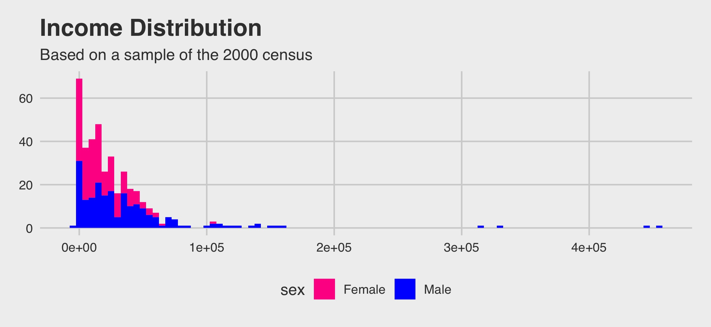

```{r setup, include=FALSE}
knitr::opts_chunk$set(echo = TRUE)
library(openintro)
library(tidyverse)
library(ggthemes)
library(infer)
```

## Final Project

For the R portion of the final, you will have two tasks. The first task is to replicate the plot below using the census dataset from the openintro package. (HINT: It does use one of the themes from the ggthemes package.)



```{r}
#Insert Your Code Here
```

Your second task is to conduct a two-sample t-test to determine if there is a difference in pay (total\_personal\_income) between males and females. Note that your test should include a written conclusion in statistical and practical terms. \
\

```{r}
#Insert Your Code Here
```
